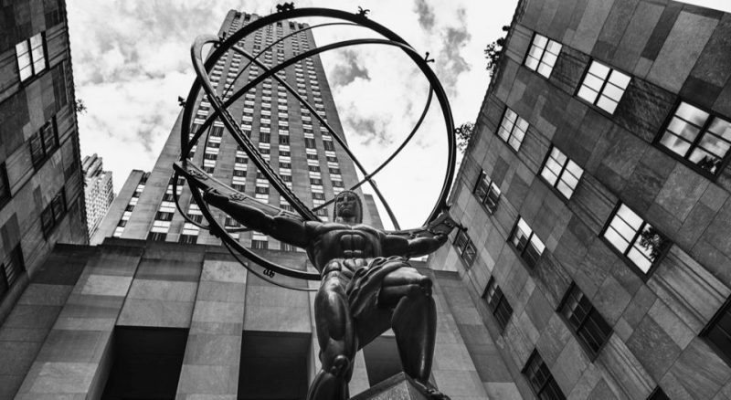
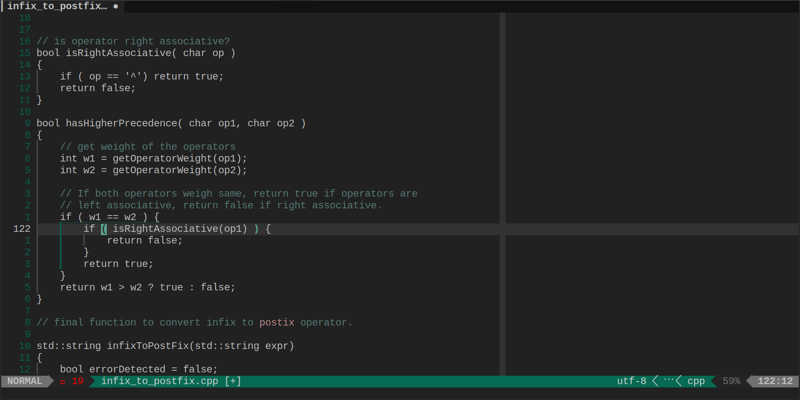

> "What is man? He's just a collection of chemicals with delusions of grandeur."

### Installation

#### Vim

```vim
Plug '5ohue/atlasue.vim'
```

Then run `:PlugInstall`.

#### Neovim (lazy)

```lua
lazy.setup({
    {'5ohue/atlasue.vim'}
})
```

### Usage

```vim
colorscheme atlasue
```

### Screenshots or it didn't happen



### Thanks

This colorscheme is a fork of [huyvohcmc/atlas.vim](https://github.com/huyvohcmc/atlas.vim) which is forked from [jacoborus/tender.vim](https://github.com/jacoborus/tender.vim) but without the colors of course.
